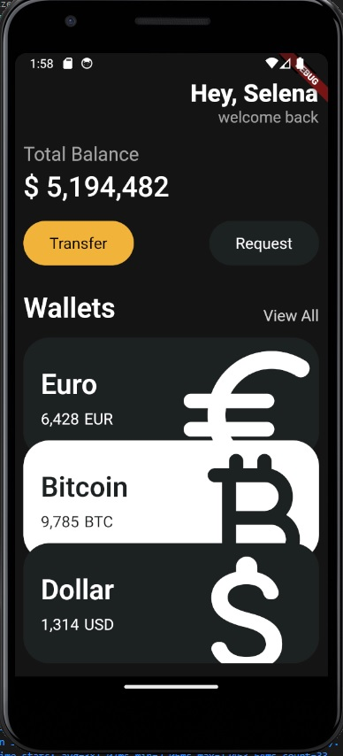

😆 배움은 항상 즐거워

# 웰메이드 위젯 클로닝



## 3.0 header

- Row의 MainAxisAlignment는 가로, Column의 MainAxisAlignment는 세로!

```dart
import 'package:flutter/material.dart';

void main() {
  runApp(App());
}

class App extends StatelessWidget {
  @override
  Widget build(BuildContext context) {
    return MaterialApp(
      home: Scaffold(
        backgroundColor: Color(0xFF181818),
        body: Padding(
          padding: EdgeInsets.symmetric(horizontal: 40),
          child: Column(
            children: [
              SizedBox(
                height: 60,
              ),
              Row(
                mainAxisAlignment: MainAxisAlignment.end,
                children: [
                  Column(
                    crossAxisAlignment: CrossAxisAlignment.end,
                    children: [
                      Text(
                        'Hey, Selena',
                        style: TextStyle(
                            color: Colors.white,
                            fontSize: 28,
                            fontWeight: FontWeight.w800),
                      ),
                      Text(
                        'welcome back',
                        style: TextStyle(
                          color: Colors.white.withOpacity(0.6),
                          fontSize: 18,
                        ),
                      ),
                    ],
                  )
                ],
              )
            ],
          ),
        ),
      ),
    );
  }
}
```

## 3.2 button sections

```dart
import 'package:flutter/material.dart';

void main() {
  runApp(App());
}

class App extends StatelessWidget {
  @override
  Widget build(BuildContext context) {
    return MaterialApp(
      home: Scaffold(
        backgroundColor: Color(0xFF181818),
        body: Padding(
          padding: EdgeInsets.symmetric(horizontal: 30),
          child: Column(
            crossAxisAlignment: CrossAxisAlignment.start,
            children: [
              SizedBox(
                height: 60,
              ),
              Row(
                mainAxisAlignment: MainAxisAlignment.end,
                children: [
                  Column(
                    crossAxisAlignment: CrossAxisAlignment.end,
                    children: [
                      Text(
                        'Hey, Selena',
                        style: TextStyle(
                            color: Colors.white,
                            fontSize: 28,
                            fontWeight: FontWeight.w800),
                      ),
                      Text(
                        'welcome back',
                        style: TextStyle(
                          color: Colors.white.withOpacity(0.6),
                          fontSize: 18,
                        ),
                      ),
                    ],
                  )
                ],
              ),
              SizedBox(
                height: 60,
              ),
              Text(
                'Total Balance',
                style: TextStyle(
                    fontSize: 22, color: Colors.white.withOpacity(0.6)),
              ),
              SizedBox(
                height: 5,
              ),
              Text(
                '\$ 5,194,482',
                style: TextStyle(
                  fontSize: 32,
                  color: Colors.white,
                  fontWeight: FontWeight.w500,
                ),
              ),
              SizedBox(
                height: 20,
              ),
              Row(
                children: [
                  Container(
                    decoration: BoxDecoration(
                      color: Colors.amber,
                      borderRadius: BorderRadius.circular(35),
                    ),
                    child: Padding(
                      padding: EdgeInsets.symmetric(
                        vertical: 15,
                        horizontal: 30,
                      ),
                      child: Text(
                        'Transfer',
                        style: TextStyle(fontSize: 18),
                      ),
                    ),
                  )
                ],
              )
            ],
          ),
        ),
      ),
    );
  }
}
```

## 3.3 vscode settings

- `backgroundColor: Color(0xFF181818)` 직접 하드코딩 된 값은 변경될이 없으니, 앞단에 `const` 를 붙여주는 것을 권장한다.
- **vscode 파란줄 없애기!**
  - vscode에서 `f1` → `>open user setting(JSON)` → settings.json에 하단 코드 추가하기
  - vscode 다시 시작하기
  - `dart.~~` 이런 코드는 다트로 코딩할 때 도움이 되는 설정

```json
"editor.codeActionsOnSave": {
    "source.fixAll": true
  },
"dart.previewFlutterUiGuides": true,
"dart.openDevTools": "flutter",
"dart.debugExternalPackageLibraries": true,
"dart.debugSdkLibraries": false
```

## 3.4 code actions

- 위젯을 커서로 선택하고 옆에 뜨는 전구는 매우 유용하다. 선택한 위젯을 다른 위젯으로 래핑할 수 있다. 언랩 역시 가능하다. `ctrl + .`

## 3.5 reusable widgets

- 전구에서 `extract widget` 를 누르면 다시 사용할 수 있는 위젯으로 만들어 준다.
- `lib\widgets\button.dart` 다트 파일 따로 만들고 위젯을 관리하자.
- 새로운 파일을 만들고, stateless 위젯을 자동완성으로 쉽게 생성할 수 있다. `st`
- main.dart

```dart
import 'package:flutter/material.dart';
import 'widgets/button.dart';

void main() {
  runApp(const App());
}

class App extends StatelessWidget {
  const App({super.key});

  @override
  Widget build(BuildContext context) {
    return MaterialApp(
      home: Scaffold(
        backgroundColor: const Color(0xFF181818),
        body: Padding(
          padding: const EdgeInsets.symmetric(horizontal: 30),
          child: Column(
            crossAxisAlignment: CrossAxisAlignment.start,
            children: [
              const SizedBox(
                height: 60,
              ),
              Row(
                mainAxisAlignment: MainAxisAlignment.end,
                children: [
                  Column(
                    crossAxisAlignment: CrossAxisAlignment.end,
                    children: [
                      const Text(
                        'Hey, Selena',
                        style: TextStyle(
                            color: Colors.white,
                            fontSize: 28,
                            fontWeight: FontWeight.w800),
                      ),
                      Text(
                        'welcome back',
                        style: TextStyle(
                          color: Colors.white.withOpacity(0.6),
                          fontSize: 18,
                        ),
                      ),
                    ],
                  )
                ],
              ),
              const SizedBox(
                height: 60,
              ),
              Text(
                'Total Balance',
                style: TextStyle(
                    fontSize: 22, color: Colors.white.withOpacity(0.6)),
              ),
              const SizedBox(
                height: 5,
              ),
              const Text(
                '\$ 5,194,482',
                style: TextStyle(
                  fontSize: 32,
                  color: Colors.white,
                  fontWeight: FontWeight.w500,
                ),
              ),
              const SizedBox(
                height: 20,
              ),
              const Row(
                mainAxisAlignment: MainAxisAlignment.spaceBetween,
                children: [
                  Button(
                    text: 'Transfer',
                    bgColor: Color(0xFFF1B33B),
                    textColor: Colors.black,
                  ),
                  Button(
                    text: 'Request',
                    bgColor: Color(0xFF1f2123),
                    textColor: Colors.white,
                  ),
                ],
              )
            ],
          ),
        ),
      ),
    );
  }
}
```

- widgets\button.dart

```dart
import 'package:flutter/material.dart';

class Button extends StatelessWidget {
  final String text;
  final Color bgColor;
  final Color textColor;

  const Button(
      {super.key,
      required this.text,
      required this.bgColor,
      required this.textColor});

  @override
  Widget build(BuildContext context) {
    return Container(
      decoration: BoxDecoration(
        color: bgColor,
        borderRadius: BorderRadius.circular(35),
      ),
      child: Padding(
        padding: const EdgeInsets.symmetric(
          vertical: 15,
          horizontal: 30,
        ),
        child: Text(
          text,
          style: TextStyle(fontSize: 18, color: textColor),
        ),
      ),
    );
  }
}
```

## 3.6 cards

- 코드 전체

  ```dart
  import 'package:flutter/material.dart';
  import 'widgets/button.dart';

  void main() {
    runApp(const App());
  }

  class App extends StatelessWidget {
    const App({super.key});

    @override
    Widget build(BuildContext context) {
      return MaterialApp(
        home: Scaffold(
          backgroundColor: const Color(0xFF181818),
          body: Padding(
            padding: const EdgeInsets.symmetric(horizontal: 30),
            child: Column(
              crossAxisAlignment: CrossAxisAlignment.start,
              children: [
                const SizedBox(
                  height: 60,
                ),
                Row(
                  mainAxisAlignment: MainAxisAlignment.end,
                  children: [
                    Column(
                      crossAxisAlignment: CrossAxisAlignment.end,
                      children: [
                        const Text(
                          'Hey, Selena',
                          style: TextStyle(
                              color: Colors.white,
                              fontSize: 28,
                              fontWeight: FontWeight.w800),
                        ),
                        Text(
                          'welcome back',
                          style: TextStyle(
                            color: Colors.white.withOpacity(0.6),
                            fontSize: 18,
                          ),
                        ),
                      ],
                    )
                  ],
                ),
                const SizedBox(
                  height: 60,
                ),
                Text(
                  'Total Balance',
                  style: TextStyle(
                      fontSize: 22, color: Colors.white.withOpacity(0.6)),
                ),
                const SizedBox(
                  height: 5,
                ),
                const Text(
                  '\$ 5,194,482',
                  style: TextStyle(
                    fontSize: 32,
                    color: Colors.white,
                    fontWeight: FontWeight.w500,
                  ),
                ),
                const SizedBox(
                  height: 20,
                ),
                const Row(
                  mainAxisAlignment: MainAxisAlignment.spaceBetween,
                  children: [
                    Button(
                      text: 'Transfer',
                      bgColor: Color(0xFFF1B33B),
                      textColor: Colors.black,
                    ),
                    Button(
                      text: 'Request',
                      bgColor: Color(0xFF1f2123),
                      textColor: Colors.white,
                    ),
                  ],
                ),
                const SizedBox(
                  height: 60,
                ),
                Row(
                  crossAxisAlignment: CrossAxisAlignment.end,
                  mainAxisAlignment: MainAxisAlignment.spaceBetween,
                  children: [
                    const Text(
                      'Wallets',
                      style: TextStyle(
                          color: Colors.white,
                          fontSize: 32,
                          fontWeight: FontWeight.w600),
                    ),
                    Text(
                      'View All',
                      style: TextStyle(
                        color: Colors.white.withOpacity(0.8),
                        fontSize: 18,
                      ),
                    ),
                  ],
                ),
                const SizedBox(
                  height: 15,
                ),
                Container(
                  decoration: BoxDecoration(
                    color: const Color(
                      0xFF1F2123,
                    ),
                    borderRadius: BorderRadius.circular(30),
                  ),
                  child: const Padding(
                    padding: EdgeInsets.all(20),
                    child: Row(
                      children: [
                        Column(
                          crossAxisAlignment: CrossAxisAlignment.start,
                          children: [
                            Text(
                              'Euro',
                              style: TextStyle(
                                color: Colors.white,
                                fontSize: 32,
                                fontWeight: FontWeight.w600,
                              ),
                            ),
                            SizedBox(
                              height: 10,
                            ),
                            Row(
                              children: [
                                Text(
                                  '6,428',
                                  style: TextStyle(
                                    color: Colors.white,
                                    fontSize: 18,
                                  ),
                                ),
                                SizedBox(
                                  width: 5,
                                ),
                                Text('EUR',
                                    style: TextStyle(
                                      color: Colors.white,
                                      fontSize: 18,
                                    )),
                              ],
                            )
                          ],
                        )
                      ],
                    ),
                  ),
                )
              ],
            ),
          ),
        ),
      );
    }
  }
  ```

## 3.7 icons and transforms

- 카드 안에 있는 아이콘의 크기를 키우면 카드 역시 같이 커진다. 이럴 때, `Transform.scale` 을 이용해보자. 트랜스폼은 해당되는 위젯의 크기만 커질 수 있도록 조정해준다.
- `clipBehavior: Clip.hardEdge` 컨테이너를 넘어서는 컨텐츠를 아예 자른다.

```dart
Container(
                clipBehavior: Clip.hardEdge,
                decoration: BoxDecoration(
                  color: const Color(
                    0xFF1F2123,
                  ),
                  borderRadius: BorderRadius.circular(30),
                ),
                child: Padding(
                  padding: const EdgeInsets.all(20),
                  child: Row(
                    mainAxisAlignment: MainAxisAlignment.spaceBetween,
                    children: [
                      const Column(
                        crossAxisAlignment: CrossAxisAlignment.start,
                        children: [
                          Text(
                            'Euro',
                            style: TextStyle(
                              color: Colors.white,
                              fontSize: 32,
                              fontWeight: FontWeight.w600,
                            ),
                          ),
                          SizedBox(
                            height: 10,
                          ),
                          Row(
                            children: [
                              Text(
                                '6,428',
                                style: TextStyle(
                                  color: Colors.white,
                                  fontSize: 18,
                                ),
                              ),
                              SizedBox(
                                width: 5,
                              ),
                              Text(
                                'EUR',
                                style: TextStyle(
                                  color: Colors.white,
                                  fontSize: 18,
                                ),
                              ),
                            ],
                          )
                        ],
                      ),
                      Transform.scale(
                        scale: 2,
                        child: Transform.translate(
                          offset: const Offset(-5, 10),
                          child: const Icon(
                            Icons.euro_rounded,
                            color: Colors.white,
                            size: 98,
                          ),
                        ),
                      ),
                    ],
                  ),
                ),
              )
```

- 코드 전체

  ```dart
  import 'package:flutter/material.dart';
  import 'widgets/button.dart';

  void main() {
    runApp(const App());
  }

  class App extends StatelessWidget {
    const App({super.key});

    @override
    Widget build(BuildContext context) {
      return MaterialApp(
        home: Scaffold(
          backgroundColor: const Color(0xFF181818),
          body: Padding(
            padding: const EdgeInsets.symmetric(horizontal: 30),
            child: Column(
              crossAxisAlignment: CrossAxisAlignment.start,
              children: [
                const SizedBox(
                  height: 60,
                ),
                Row(
                  mainAxisAlignment: MainAxisAlignment.end,
                  children: [
                    Column(
                      crossAxisAlignment: CrossAxisAlignment.end,
                      children: [
                        const Text(
                          'Hey, Selena',
                          style: TextStyle(
                              color: Colors.white,
                              fontSize: 28,
                              fontWeight: FontWeight.w800),
                        ),
                        Text(
                          'welcome back',
                          style: TextStyle(
                            color: Colors.white.withOpacity(0.6),
                            fontSize: 18,
                          ),
                        ),
                      ],
                    )
                  ],
                ),
                const SizedBox(
                  height: 60,
                ),
                Text(
                  'Total Balance',
                  style: TextStyle(
                      fontSize: 22, color: Colors.white.withOpacity(0.6)),
                ),
                const SizedBox(
                  height: 5,
                ),
                const Text(
                  '\$ 5,194,482',
                  style: TextStyle(
                    fontSize: 32,
                    color: Colors.white,
                    fontWeight: FontWeight.w500,
                  ),
                ),
                const SizedBox(
                  height: 20,
                ),
                const Row(
                  mainAxisAlignment: MainAxisAlignment.spaceBetween,
                  children: [
                    Button(
                      text: 'Transfer',
                      bgColor: Color(0xFFF1B33B),
                      textColor: Colors.black,
                    ),
                    Button(
                      text: 'Request',
                      bgColor: Color(0xFF1f2123),
                      textColor: Colors.white,
                    ),
                  ],
                ),
                const SizedBox(
                  height: 60,
                ),
                Row(
                  crossAxisAlignment: CrossAxisAlignment.end,
                  mainAxisAlignment: MainAxisAlignment.spaceBetween,
                  children: [
                    const Text(
                      'Wallets',
                      style: TextStyle(
                          color: Colors.white,
                          fontSize: 32,
                          fontWeight: FontWeight.w600),
                    ),
                    Text(
                      'View All',
                      style: TextStyle(
                        color: Colors.white.withOpacity(0.8),
                        fontSize: 18,
                      ),
                    ),
                  ],
                ),
                const SizedBox(
                  height: 15,
                ),
                Container(
                  clipBehavior: Clip.hardEdge,
                  decoration: BoxDecoration(
                    color: const Color(
                      0xFF1F2123,
                    ),
                    borderRadius: BorderRadius.circular(30),
                  ),
                  child: Padding(
                    padding: const EdgeInsets.all(20),
                    child: Row(
                      mainAxisAlignment: MainAxisAlignment.spaceBetween,
                      children: [
                        const Column(
                          crossAxisAlignment: CrossAxisAlignment.start,
                          children: [
                            Text(
                              'Euro',
                              style: TextStyle(
                                color: Colors.white,
                                fontSize: 32,
                                fontWeight: FontWeight.w600,
                              ),
                            ),
                            SizedBox(
                              height: 10,
                            ),
                            Row(
                              children: [
                                Text(
                                  '6,428',
                                  style: TextStyle(
                                    color: Colors.white,
                                    fontSize: 18,
                                  ),
                                ),
                                SizedBox(
                                  width: 5,
                                ),
                                Text(
                                  'EUR',
                                  style: TextStyle(
                                    color: Colors.white,
                                    fontSize: 18,
                                  ),
                                ),
                              ],
                            )
                          ],
                        ),
                        Transform.scale(
                          scale: 2,
                          child: Transform.translate(
                            offset: const Offset(-5, 10),
                            child: const Icon(
                              Icons.euro_rounded,
                              color: Colors.white,
                              size: 98,
                            ),
                          ),
                        ),
                      ],
                    ),
                  ),
                )
              ],
            ),
          ),
        ),
      );
    }
  }
  ```
